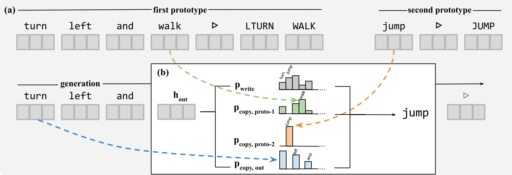

# Learning to Recombine Data for Compositional Generalization

This repository is the official implementation of Learning to Recombine Data for Compositional Generalization. It is for reviewing purposes only, please do not distribute.



## Dependencies
- **OS**: Linux or macOS
- **Language**: Julia 1.2.0 (if not available, the setup script will automatically install a local copy.)
- **Hardware**: NVIDIA GPU (that supports CUDA and cuDNN), with network connection, 3GB disk space including Julia installation. (we only tested with 32GB V100s)
- **Libraries**: CUDA Runtime Library and cuDNN Developer Toolkits (tested with CUDA: 10.1.105_418.39 and cuDNN: 7.5.0)
  - If you don't have them, you might get a warning about GPU functionality which means you are not able to run the code with a GPU. If this is the case, _follow the [instructions](https://stackoverflow.com/a/47503155)_ by using the below download links selecting the abovementioned versions. This is a local installation and will not affect your system.
  ```
  CUDA: https://developer.nvidia.com/cuda-10.1-download-archive-base
  CUDNN: https://developer.nvidia.com/rdp/cudnn-archive
  ```
  Do remember to add the below commands to your `.bashrc` replacing `$CUDAPATH` with your installation path.
  ```SHELL
  export PATH=$CUDAPATH/bin:$PATH
  export LD_LIBRARY_PATH=$CUDAPATH/lib64:$LD_LIBRARY_PATH
  ```
- **Optional**:
  - Jupyter Notebook with Python 3 (Used for analysis of results.)


Note that since this codebase is for reproducibility purposes you might require specific versions of the dependencies as described below. We found AWS AMI: Knet-1.3.0 (ami-0469b38d93e8ab9da) compatible with the requirements here, you might consider it for convenience.

## Requirements

To install requirements:
```SHELL
   git clone https://github.com/ekinakyurek/compgen
   cd compgen
   sh setup.sh
```
`setup.sh` performs the following steps interactively:
1. If Julia 1.2.0 is not available, it downloads and installs it locally.
2. Installs the exact versions of the required Julia packages to a local environment.
3. Downloads raw dataset files of `SCAN` and `SIGMORPHON 2018` to the [data/](data/) folder.
4. Downloads `SCAN` and `SIGMORPHON 2018` preprocessed neighborhood files from server.

  **Optional**:
5. Downloads pre-trained generative models for `SCAN` and `SIGMORPHON 2018` along with generated samples to the [checkpoints/](checkpoints/) folder.

Note that if there are issues with any of the steps 1 through 4, the experiments might fail.


## Training

To verify the results presented in the paper, you may run the scripts to train models and see the evaluations. During training logs will be created at [checkpoints/](checkpoints/) folder.

All experiment scripts can be found at [exps/](exps/)

For example to run the 2-proto model with VAE on the `jump` split of `SCAN`, use

```SHELL
cd exps
./jump_vae_2proto.sh
```

which runs the entire pipeline (train generative model -> generate samples -> train conditional model with augmented data). The logs and saved models can be found under [checkpoints/](checkpoints/) folder.

> 📋 Note that the experiments are tested on NVIDIA 32GB V100 Volta GPUs. For some models GPU requirements might be high. Assuming the same setup, each experiment should run less than one hour.

## Evaluation

After running an experiment, evaluation results can be found under [checkpoints/](checkpoints/) at the end of the files named `*condconfig`. After running multiple experiments, we provide a convenience script which collates the results:

```SHELL
sh collect.sh
```

Moreover, after running all experiments, one can refer to `analyze_results.ipynb` Jupyter Notebook to obtain the figures and tables provided in the paper.


## Pre-trained Models

`setup.sh` optionally downloads the pre-trained models. See **Requirements** section.

## Results

### Table 1


| Model    |   ('Acc', 'AROUND RIGHT') |   ('Acc', 'JUMP') |
|:---------|--------------------------:|------------------:|
| baseline |                      0    |              0    |
| geca     |                      0.82 |              0.87 |
| 0proto   |                      0    |              0    |
| 1proto   |                      0.16 |              0    |
| 2proto   |                      0.51 |              0.88 |


### Table 2

| Model    |   ('Future Tense', 'Acc') |   ('Future Tense', 'F1') |   ('Past Tense', 'Acc') |   ('Past Tense', 'F1') |   ('Present Tense', 'Acc') |   ('Present Tense', 'F1') |
|:---------|--------------------------:|-------------------------:|------------------------:|-----------------------:|---------------------------:|--------------------------:|
| baseline |                      0.13 |                     0.7  |                    0.03 |                   0.55 |                       0.6  |                      0.88 |
| geca     |                      0.24 |                     0.76 |                    0.07 |                   0.6  |                       0.58 |                      0.87 |
| 0proto   |                      0.36 |                     0.79 |                    0.06 |                   0.61 |                       0.56 |                      0.85 |
| 1proto   |                      0.31 |                     0.8  |                    0.05 |                   0.59 |                       0.57 |                      0.87 |
| 2proto   |                      0.19 |                     0.77 |                    0.03 |                   0.59 |                       0.59 |                      0.87 |


## Trouble Shooting
If you get a warning tells that Knet or CuArrays can't see the GPU, you should refer to requirements section
If you get `ERROR: LoadError: cudnnRNNBackwardData: 8: CUDNN_STATUS_EXECUTION_FAILED`, it means you need more GPU memory.
